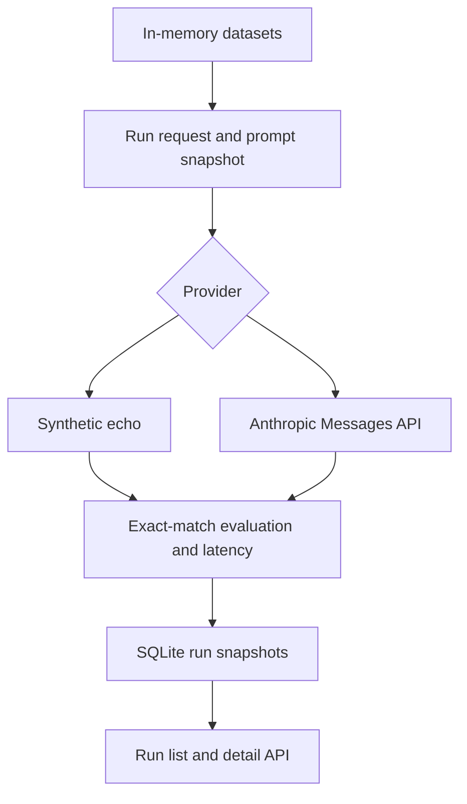

# LLM Evaluation Platform

A focused Python/FastAPI project for running datasets through a provider, evaluating outputs, and inspecting saved results. **Status: backend MVP; dashboard and broader quality metrics are planned.**

## Implemented

- Health endpoint and strict Pydantic domain schemas
- In-memory dataset CRUD
- Provider interface with a synthetic echo adapter and server-side Anthropic adapter
- Sequential evaluation runner with versioned prompt snapshots
- Strict exact-match outcomes: pass/fail, score, reason
- Per-case latency and provider token usage when available
- SQLite storage of completed run records, including dataset/prompt snapshots and case errors
- Run list/detail APIs and a reproducible prompt comparison
- Automated backend tests and GitHub Actions CI

September 21, 2026 milestone 3 introduced deterministic exact match. The runner extends that foundation; the evaluator's strict semantics remain unchanged.

## Architecture



## Start locally

Requires Python 3.12 or newer.

```bash
cd backend
python -m venv .venv
source .venv/bin/activate   # Windows: .venv\Scripts\activate
pip install -r requirements.txt
uvicorn app.main:app --reload
```

Open http://localhost:8000/docs. Echo runs need no credentials.
For live Anthropic runs, export `ANTHROPIC_API_KEY` and optionally `CLAUDE_MODEL` (default `claude-sonnet-4-6`) in the server environment. Live calls incur provider usage. `.env.example` documents settings; this app does not automatically load that file.

`EVALUATION_DB_PATH` defaults to `data/evaluations.db`, relative to the backend working directory. Dataset CRUD is still in memory, but saved runs include snapshots and remain readable after a restart.

## Tests and reproducible demo

```bash
python -m pytest -q
python -m examples.compare_prompts
```

The comparison runs three fixtures through **echo**, first with `{input}`, then with `Answer: {input}`. It saves both runs to `data/demo-evaluations.db` and writes measured local durations to `data/demo-comparison.json`. Expected pass rates are 3/3 and 0/3. This proves the evaluation/storage flow; it is not an LLM-quality benchmark. CI uploads the JSON as an artifact.

## Example API flow

```bash
curl -X POST http://localhost:8000/datasets \
  -H 'Content-Type: application/json' \
  -d '{"name":"answer-fixtures","cases":[{"input":"42","expected_output":"42"}]}'
```

Copy the returned dataset `id` into the next request:

```bash
curl -X POST http://localhost:8000/runs \
  -H 'Content-Type: application/json' \
  -d '{"dataset_id":"REPLACE_WITH_DATASET_ID","provider":"echo","prompt_name":"identity","prompt_version":1,"prompt_template":"{input}"}'
curl http://localhost:8000/runs
```

`GET /runs/{run_id}` returns a saved run with its dataset, prompt, case outputs, outcomes, errors, and summary. Use `provider: "anthropic"` to exercise the live adapter.

## Engineering decisions

Exact match precedes LLM-as-a-judge because its scoring is reproducible for fixed strings. Case and whitespace differences fail; two empty strings match at the evaluator level, although dataset expected outputs currently must be non-empty. A valid paraphrase can fail exact match.

A single provider interface separates generation from scoring. Provider errors are recorded separately from output mismatches; a run with provider errors is `failed`, while a completed run can have a zero pass rate. Pass rate includes all cases in the denominator. Missing credentials produce an explicit configuration error rather than switching a live run to echo.

SQLite stores self-contained snapshots without requiring a separate database service. Latency measures the local generation/evaluation duration per case. Token usage comes from the provider; estimated cost remains null because no pricing calculation is implemented.

## Current limitations

- Dataset editing is not persistent; prompt versions are run snapshots rather than a version registry.
- Execution is synchronous and sequential, with no queue, retries, streaming, or resume support.
- The Anthropic adapter has a 25-second HTTP timeout per case; a multi-case request can take substantially longer.
- Runs accept up to 20 cases, input strings up to 4,000 characters, and rendered prompts up to 12,000 characters.
- No authentication, rate limiting, tracing, dashboard, PostgreSQL deployment, OpenAI adapter, or semantic-quality evaluator.
- Run data includes prompts and outputs. Use local development data; this API needs access controls before public exposure with a provider key.
- CI uses mocked providers and echo; live Anthropic behavior is not exercised by tests.

## Next milestones

Persist datasets, add a queue for longer jobs, add section/schema checks and report-quality rubrics, then build a dashboard. Add a calibrated judge only for subjective dimensions that deterministic checks cannot assess.

## Portfolio context

[InsightForge](https://github.com/tejaswaroop999/personalized-ai-report) demonstrates a user-facing Claude product. This project demonstrates evaluation infrastructure. They are separate applications; direct integration is future work.
